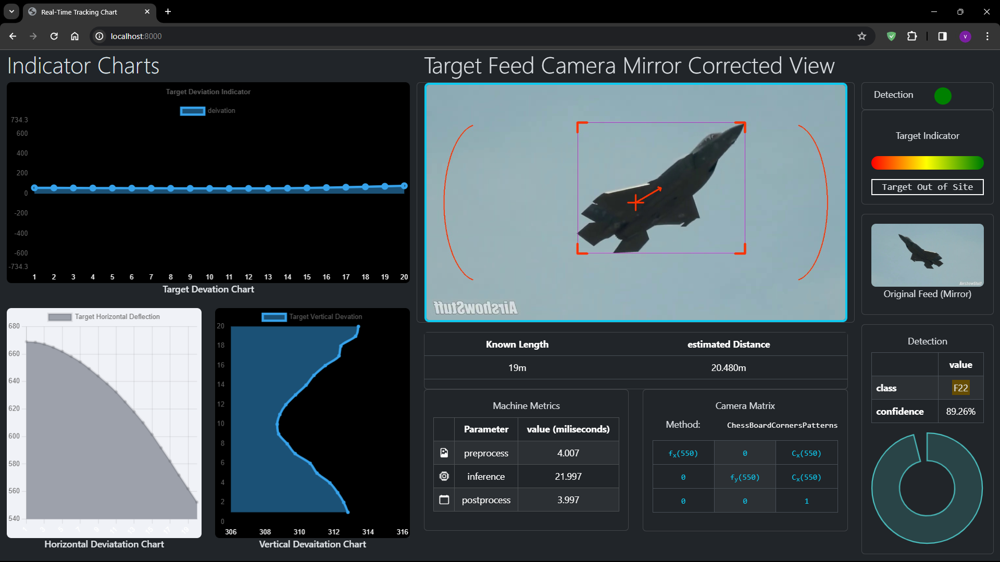

# Aerolense: <i> Military Aircraft Detection Using Deep Learning Model </i>

## By using DeepLearning (<code>YOLO</code>) we try to automate the **Tracking** and **Targeting** of military aircraft and control weapon system to target the threat automatically based on instructions from Aerolense

## This is docker version of the Aerolense if you want the orignal python code please visit <a href="https://github.com/rookie-engg/BE-Project-Aerolense">BE-Project-Aerolense</a>

## You need Docker to be installed for this project to run 
### for quickly running
```bash
git clone https://github.com/rookie-engg/BE-Project-Aerolense-Docker
```
### change directory
```bash
cd BE-Project-Aerolense-Docker
```
### start docker
```bash
docker compose up
```

### Here is a demo screenshot
